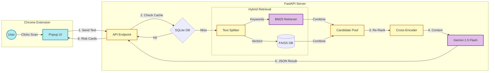

# ⚖️ Fine-Print Bodyguard

**An Agentic RAG Browser Extension that audits Terms of Service so you don't have to.**


## 🚀 The Problem
We all click **"I Agree"** without reading. Companies hide predatory clauses—like forced arbitration, data selling, and IP theft—buried in thousands of words of legal jargon.

## 🛡️ The Solution
**Fine-Print Bodyguard** is a Chrome Extension powered by an **Advanced RAG (Retrieval-Augmented Generation)** backend. It doesn't just summarize; it acts as a **Privacy Auditor**. It scans the text against a strict "User Constitution" and alerts you only when your rights are violated.

## ✨ Key Features

* **🔍 Hybrid Search Architecture:** Combines **BM25** (Keyword Search) and **FAISS** (Semantic Vector Search) to ensure no legal clause is missed.
* **🧠 AI Re-Ranking:** Uses a **Cross-Encoder** to double-check and rank retrieved clauses before sending them to the LLM, reducing hallucinations.
* **⚡ Smart Caching:** Uses **SQLite** to cache results. Re-visiting a page is instant and costs $0 in API fees.
* **🚦 Visual Risk Meter:** Instantly assigns a **Safety Score (0-100%)** and categorizes the policy as Excellent, Caution, or Critical Risk.
* **📝 Evidence-Based Reporting:** Doesn't just say "Unsafe." It generates **Fault Cards** quoting the exact sentence from the policy that violates your rights.

---

## 🏗️ Architecture

This project uses a **Client-Server** architecture to overcome browser limitations and run heavy AI models.



---

## 🛠️ Tech Stack

* **Frontend:** HTML, CSS, Vanilla JavaScript (Chrome Extension Manifest V3).
* **Backend:** Python, FastAPI.
* **AI Orchestration:** LangChain.
* **Vector Database:** FAISS (CPU).
* **LLM:** Google Gemini 2.5 Flash.
* **Re-Ranker:** `cross-encoder/ms-marco-MiniLM-L-6-v2`.

---

## ⚙️ Installation & Setup

### 1. Backend Setup (The Brain)
You need Python installed.

1. **Clone the repo** and navigate to the backend folder:
    ```bash
    cd fine-print-bodyguard/backend
    ```

2. **Install Dependencies:**
    ```bash
    pip install -r requirements.txt
    ```

3. **Setup API Key:**
    * Get a free API Key from [Google AI Studio](https://aistudio.google.com/).
    * Create a file named `.env` in the `backend` folder.
    * Add this line:
        ```text
        GOOGLE_API_KEY=your_api_key_here
        ```

4. **Start the Server:**
    ```bash
    uvicorn main:app --reload
    ```
    *You should see `Application startup complete`.*

### 2. Frontend Setup (The Extension)

1. Open Google Chrome and navigate to `chrome://extensions`.
2. Toggle **Developer Mode** (top right corner) to **ON**.
3. Click **Load Unpacked**.
4. Select the `fine-print-bodyguard/extension` folder.
5. **Important:** Click the "Details" button on the new extension and toggle **"Allow access to file URLs"** ON (if you want to test on local HTML files).

---

## 📖 How to Use

1. **Visit any website** with a Terms of Service page (e.g., Facebook Terms, TikTok, or a local test file).
2. Click the **Scale Icon ⚖️** in your browser toolbar.
3. Click **"SCAN PAGE NOW"**.
4. Wait 5-10 seconds for the Hybrid RAG pipeline to process.
5. View your **Safety Score** and read the **Risk Cards** to see exactly what they are trying to hide.

---

## 🔧 Configuration (The "User Constitution")

You can customize what the AI looks for by editing `backend/main.py`. Look for the `USER_CONSTITUTION` list:

```python
USER_CONSTITUTION = [
    "Does the policy allow them to sell my data to third parties?",
    "Is there a mandatory binding arbitration clause?",
    "Can they track my location when I am not using the app?",
    # Add your own red lines here!
]

```

---

## 📂 Project Structure

```bash

fine-print-bodyguard/
├── backend/
│   ├── main.py             # FastAPI server + RAG Logic
│   ├── requirements.txt    # Python dependencies
│   ├── .env                # API Key (Hidden)
│   └── cache.db            # SQLite Cache (Auto-generated)
└── extension/
    ├── manifest.json       # Chrome config
    ├── popup.html          # The UI Layout
    ├── popup.js            # Frontend Logic
   


```
## Design and Result


---

## 🐛 Troubleshooting

* **Error: "Backend not running"**: Ensure your terminal shows `Uvicorn running...` and you haven't closed that window.
* **Score is always 100% on a local file**: Make sure **"Allow access to file URLs"** is ON in Chrome Extension settings.
* **Rate Limit Error**: The project uses Batch Processing to minimize calls, but if you spam it, Gemini Free Tier might pause you for a minute. Wait and try again.


---

## 📜 License
This project is open-source. Feel free to use it to protect your own data!